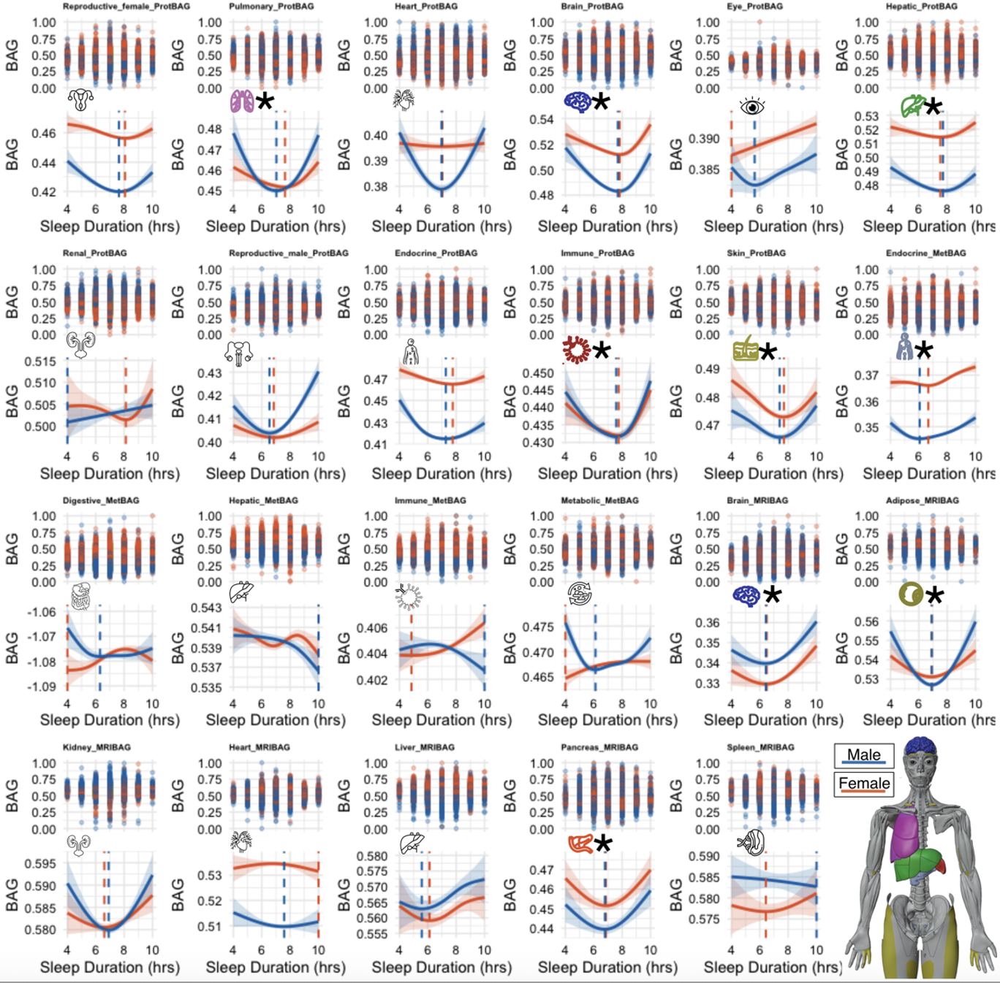

# SleepChart
This is the repository for sharing the R script for the GAM modeling between sleep duration and 23 biological aging clocks.

  

## Portal
All results and GWAS summary statistics are publicly disseminated at our SleepChart portal: https://labs-laboratory.com/sleepchart/

## Data
As the main analysis used data from the UK Biobank, we cannot publicly distribute any individual-level data, including the sleep duration measurement and the 23 biological aging clocks. We provided a script for the users to adapt, where the users can provide the input CSV/TSV using their own UK Biobank generated data

## Citing this work
> The MULTI Consortium et al., 2026. **Sleep chart of biological aging clocks in middle and late life**. ***<ins>Nature</ins>***, [doi:TO FILL]() - [Paper in PDF]()

## Related references for the 23 biological aging clocks
> The MULTI Consortium et al., 2025. **MRI-based multi-organ clocks for healthy aging and disease assessment**. ***<ins>Nature Medicine</ins>***, [doi:10.1038/s41591-025-03999-8](https://www.nature.com/articles/s41591-025-03999-8)

> Wen, 2025. **Refining the generation, interpretation and application of multi-organ, multi-omics biological aging clocks**. ***<ins>Nature Aging</ins>***, [doi:10.1038/s43587-025-00928-9](https://www.nature.com/articles/s43587-025-00928-9)

> The MULTI Consortium et al., 2025. **Multi-organ metabolome biological age implicates cardiometabolic conditions and mortality risk**. ***<ins>Nature Communications</ins>***, [doi:10.1038/s41467-025-59964-z](https://www.nature.com/articles/s41467-025-59964-z)
